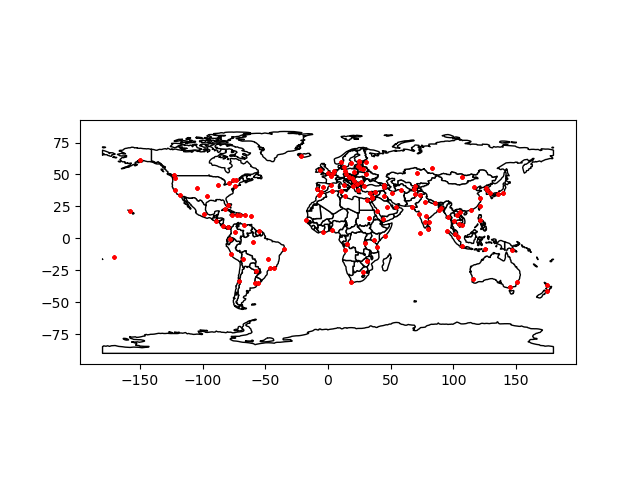
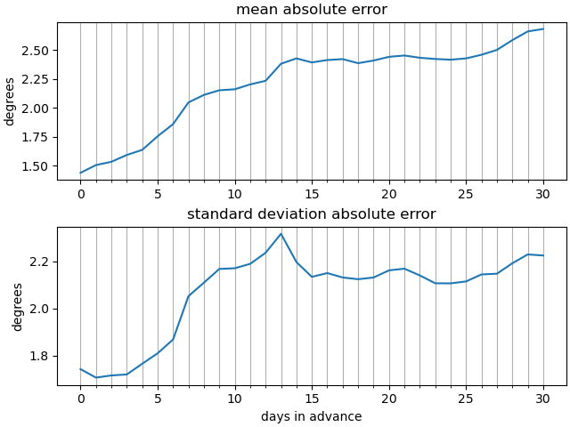
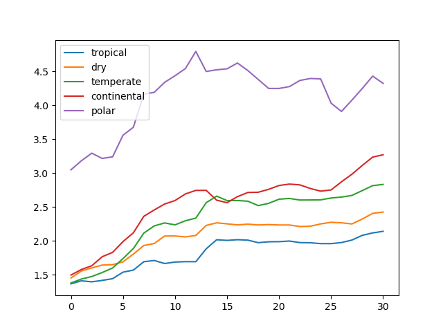
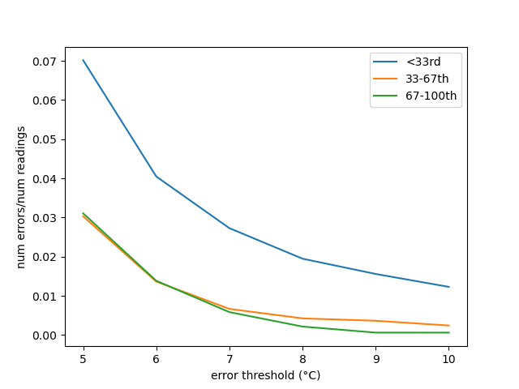

# Weather Data Project

This purpose of this project is several fold: data science practice, CV-padding and satisfying curiosity being the foremost reasons for its existence. Weather data is excellent for data science practice - you have to deal with time series, geospatial data and a notoriously unpredictable system.

I am not a weather company, so I do not have direct access to advance meteorological data, nor any desire to get that deep into things for a personal project. What I can access, however, is the predictions of others. This project works on data scraped from accuweather. The data was scraped over a period of about 40 days in 2020 when this project was initiated.

Subsequently, I did nothing with the project for the next three years, but recently had the opportunity and good reason to return to it and finally process some of the data. The whole process is summarised below, and complete detail (including all the relevant code) is present in the included notebooks.

## What questions do we want to answer?
The initial angle for this project came from the observation that some weather companies claim forecasts for months in advance. This seems [ambitious](https://www.washingtonpost.com/news/capital-weather-gang/wp/2016/04/11/accuweather-extends-its-controversial-45-day-weather-forecasts-to-90-days/), since 90 days is a season.

By collecting data over a long period it should be possible to assess if these advance forecasts are worth much. However, after I had gathered this data, I realised there were other interesting questions I could address, with the added benefit of getting practice wrangling more real-world data. I will thus address these 3 questions:

- Are weather predictions more than 2 weeks in advance informative?
- How much does climate type (e.g. tropical, continental, polar) influence weather predictability?
- How much does GDP impact forecast accuracy?

## Data Gathering
### Collection
The data for this project was scraped from accuweather. For the purposes of the far-in-advance (greater than two week) forecasts, this is the only way to access the data as there is no API facility for this. The data scraping process is described in [data_collection.ipynb](data_collection.ipynb). We collect data for the 150 'top' accuweather cities (what makes a city 'top' I'm not sure, but they bias towards larger cities, and Europe). These are distributed as shown below.

Additional data containing climate and GDP information has been downloaded from elsewhere, and is included in the [data](data) folder.

### Cleaning
The data is processed in [data_preparation.ipynb](data_preparation.ipynb). We generate two dataframes

1. A pandas dataframe multi-indexed by 1. city, 2. high/low prediction and 3. forecasted date, i.e. the date we want to know the weather for. The columns indicate collection date offset, i.e. how many days ago the forecast was collected, so we will have many forecasts collected at various points in advance for a single day. The data is the absolute error between the temperature on the day the forecast was collected and the observed temperature.
2. A geopandas dataframe, indexed by city. It includes the climate classification, the coordinates in Lat/Lon format and purchasing power parity-adjusted GDP for the countries containing the cities.

## The Results
The data is visualised in [visualisation.ipynb](visualisation.ipynb). We include some highlight results here as an answer to the three questions above.

#### Q1. Are weather predictions more than 2 weeks in advance useful?

Probably not. This question is vaguely formulated, a better formulation would be: Are accuweather forecasts more than 2 weeks in advance more informative than forecasts obtained purely based on historical data? To answer this question, we need to try to make a forecast based on historical data, which I plan to do, but have not yet completed.

However, in lieu of this, we can look at an informative proxy: if the weather forecast is more informative than using the historical data, then we would expect it to be *more accurate* for more recent dates, i.e. the 15-day-out forecast should be less error prone than the 25-day out forecast. 

The above plots show something interesting. The mean absolute error does not meaningfully increase between about 14-25 days. There is an uptick after this, but I believe it may be an artefact due to the scarcity of my own collected data that far out in advance, i.e. a small sample size. Hence, predicting 15 days in advance is about as good as 25 days in advance, suggesting that advance meteorological data has not got a large impact.

Even more interesting is the sharp drop in the standard deviation of the absolute error. To me this suggests the possibility that the predictive model used by accuweather changes after the two-week mark, possibly to one reliant primarily on historical data.

Hence we get our non-definitive answer to the question: probably not.

#### Q2. How much does climate type (e.g. tropical, continental, polar) influence weather predictability?

Substantially. The plot below shows a big difference, with the most interesting take-away being how predictable tropical climates are. 

For this to be more reliable, I would have to gather cross-seasonal data.

#### Q3. How much does GDP impact forecast accuracy?

Again, substantially it appears. The below plot shows the error as a ratio to total number of readings, where by 'error' I mean deviation of 5 or more degrees from the true result when forecast only one day in advance (i.e. tomorrow's weather prediction ends up being more than 5 degrees off). The countries in the lower third of GDPs have far more numerous errors than those in the middle or upper thirds.

This difference is made even more stark by the fact that these countries bias tropical, which should make their weather *easier* to predict. More information about this is included in this [visualisation notebook](visualisation.ipynb).

## Final considerations
This is a complex topic and the data I collected is over a limited time period. There are many uncontrolled variables which could influence the observed data which I have not considered - given the low-stakes nature of this project, however, I think this is acceptable; the time investment would not be worth it.

Ultimately, the most significant improvement would be made by collecting data over a longer period of time, and by collecting data from multiple sources. Hence a next step, if I continue the project, will be to set up a schedule for future data collection.

An additional next step would be to do a bit of modelling using historical data, to see how well we can reach accuweather's predictions even without any concurrent meteorological data.